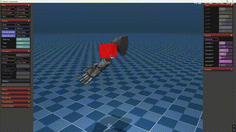

# HopeJr Reaching Generation

A robotic arm reaching motion generation project based on optimal control methods and Diffusion/Flow Matching Policy, using the open-source HopeJr humanoid robotic arm.

## Project Overview

This project combines optimal control theory with Imitation learning to generate trajectories for robotic arm reaching tasks. The project constructs a complete robotic arm motion planning solution through large-scale data generation and deep learning training.

<p align="center">
  
</p>

## Core Functional Modules

### 1. Trajectory Optimization Generation
- **hopejr_Optimizer_SLSQP.py**: SLSQP algorithm-based trajectory optimizer for generating constraint-satisfying reaching trajectories as Expert trajectory
- **hopejr_AutoGenerator.py**: Automatically sets up numerous random tasks and calls the optimizer to generate training data in batches
- **hopejr_Generator.py**: Single task setup and solving with support for custom target positions and obstacles

### 2. Kinematics Solving
- **hopejr_IKSolver.py**: Numerical optimization-based inverse kinematics solver
- **hopejr_RRTConnector.py**: RRT Connect algorithm implementation for path planning, providing initial guesses for the optimizer

### 3. Data Processing
- **hopejr_DatasetProcessor.py**: Converts optimizer-generated trajectory data into PyTorch-compatible training format with specific horizon for diffusion policy
- **hopejr_ReplayerDataset.py**: Dataset visualization and trajectory playback tool

### 4. Training and Inference
##### a. Diffusion Policy
- **hopejr_DPTrainer.py**: Diffusion Policy network architecture definition and training pipeline
- **hopejr_DPInference.py**: Loads trained models and performs real-time control testing in MuJoCo environment
  
##### b. Flow Matching Policy
- **hopejr_FMTrainer.py**: Flow Matching Policy network architecture definition and training pipeline
- **hopejr_FMInference.py**: Loads trained models and performs real-time control testing in MuJoCo environment

## Technical Features

1. **Multi-level Optimization**: Combines RRT path planning with SLSQP optimization to ensure trajectory quality
2. **Large-scale Data Generation**: Automatically generates tens of thousands of high-quality trajectories for deep learning training without manual trajectory collection and annotation requirement
3. **End-to-end Learning**: Directly generates joint angle sequences from state observations
4. **Real-time Control**: Trained models can control the robotic arm in real-time within the MuJoCo simulation environment

## Usage

### Data Generation
```python
#Batch generate training data
python scripts/hopejr_AutoGenerator.py

#Single task generation
python scripts/hopejr_Generator.py

#Playback and view generated trajectory data
python scripts/hopejr_ReplayerDataset.py
```

### Data Processing
```python
#Process trajectory data into training format
python scripts/hopejr_DatasetProcessor.py
```

### Model Training
```python
#Train Diffusion Policy model
python scripts/hopejr_DPTrainer.py

#Train Flow Matching Policy model
python scripts/hopejr_FMTrainer.py
```

### Model Testing
```python
#Test trained DPmodel in MuJoCo environment
python scripts/hopejr_DPInference.py

#Test trained FMmodel in MuJoCo environment
python scripts/hopejr_FMInference.py
```

## Contributions and Support

This project is developed based on the open-source HopeJr robotic arm platform from HuggingFace and The Robot Studio. Thanks to the open-source community for their contributions.